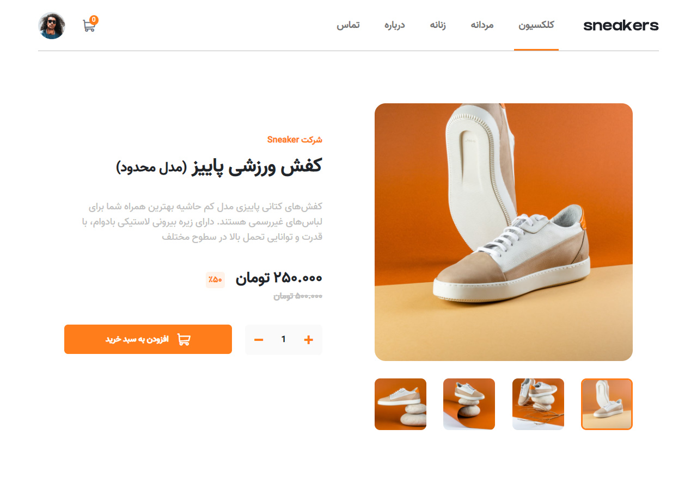

# E-commerce product page solution

## Table of contents

- [Overview](#overview)
  - [The challenge](#the-challenge)
  - [Screenshot](#screenshot)
  - [Links](#links)
- [My process](#my-process)
  - [Built with](#built-with)
  - [What I learned](#what-i-learned)
  - [Useful resources](#useful-resources)
- [Author](#author)
- [Challenge](#Challenge)

## Overview

### The challenge

Users should be able to:

- View the optimal layout for the site depending on their device's screen size
- See hover states for all interactive elements on the page
- Open a lightbox gallery by clicking on the large product image
- Switch the large product image by clicking on the small thumbnail images
- Add items to the cart
- View the cart and remove items from it

### Screenshot



### Links

- Live Site URL: [Live](https://ecommerce-product-page-xi.vercel.app/)
- Solution URL: [solution](https://github.com/MiladRostami01/Ecommerce-product-page)

## My process

### Built with

- HTML5 markup
- CSS custom properties
- Flexbox
- CSS Grid
- Desktop-first workflow
- [Bootstrap](https://getbootstrap.com/) - css library
- [sass](https://nextjs.org/) - css preprocessor

### What I learned

-How to create lighbox and Responsive it
-How to add items to cart and remove it
-How to create sidebar menu in mobile veiw size

```html
<!-- Gallery start -->
<div class="col-lg-6 col-md-12 my-5 px-5 mr-gallery">
  <!-- Main show -->
  <div class="mr-main-slides">
    
    
    
    

    <!-- next prve bnt -->
    <a class="mr-main-prev mr-main-btn">&#10094;</a>
    <a class="mr-main-next mr-main-btn">&#10095;</a>
  </div>

  <!-- image list  -->
  <div class="d-md-flex d-sm-none justify-content-between mr-main-dots">
    <div class="mr-main-dot-container mr-active">
      </img>
    </div>
    <div class="mr-main-dot-container">
      </img>
    </div>
    <div class="mr-main-dot-container">
      </img>
      </<div>
    </div>
    <div class="mr-main-dot-container">
      </img>
    </div>
  </div>
<!-- Gallery end -->
```

```js
// MODAL
const modal = document.querySelector('.mr-modal')
const closeModal = document.querySelector('.mr-modal-close')
const modalSlides = [...document.querySelectorAll('.mr-modalSlide')]
const modalDotContainer = [...document.querySelectorAll('.mr-modal-dot-container')]
const modalDots =[...document.querySelectorAll('.mr-modal-dot')]

const modalPrev = document.querySelector('.mr-modal-prev')
const modalNext = document.querySelector('.mr-modal-next')

let modalIndex = 1 


const openModal = () => modal.style.display="flex"
closeModal.addEventListener('click', ()=> {
  modal.style.display="none"
})

// modal slider
const modalShow = (num) =>{
  modalSlides.map(slide => {
    slide.style.display= "none"
  })
  modalIndex = num
  if(num > modalSlides.length) modalIndex = 1
  if(num < 1) modalIndex = modalSlides.length
  atctiveHandler(modalIndex, modalDotContainer)
  modalSlides[modalIndex-1].style.display= 'block'
}
modalShow(modalIndex)

const modalPlus = (num)=> modalShow(modalIndex = parseInt(modalIndex) + num)

modalPrev.addEventListener('click',()=> modalPlus(-1))
modalNext.addEventListener('click',()=> modalPlus(1))

mainSlides.map(slide => {
  slide.addEventListener('click', ()=> {
    if(window.innerWidth < 992) return
    openModal()
    modalShow(slide.dataset.mainId)
  })
})

modalDots.map(dot => {
  dot.addEventListener('click', () => {
    modalShow(dot.dataset.modalDotId)
  })
})
```


### Useful resources

- [Lightbox](https://www.w3schools.com/howto/howto_js_lightbox.asp) - This helped me for create lightbox. I really liked this pattern and will use it going forward.

## Author

- Website - [miladrostami.ir](https://miladrostami01.ir/)
- Instagram - [milad_rostami_01](https://www.instagram.com/milad_rostami_01/)
- Linkedin - [miladrostami01](https://www.linkedin.com/in/miladrostami01/)

## Challenge

This is a solution to the [E-commerce product page challenge on Frontend Mentor](https://www.frontendmentor.io/challenges/ecommerce-product-page-UPsZ9MJp6). Frontend Mentor challenges help you improve your coding skills by building realistic projects.
